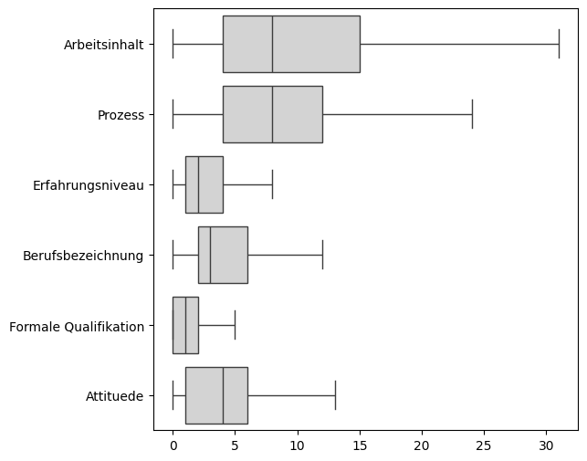
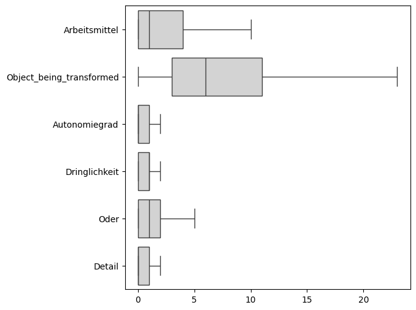
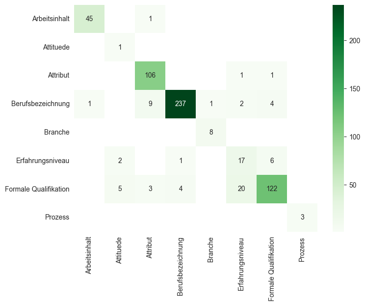

# Deskriptive Analysen
Im Rahmen des Berufs- und Kompetenzradars wurden 500 Stellenanzeigen mithilfe der Annotationsguidelines annotiert. Insgesamt haben 19 verschiedene Annotator/innen mitgewirkt und jede Anzeige wurde von zwei Personen unabhängig voneinander annotiert und anschließend von einer dritten Person kuratiert.

Auf Grundlage dieser Stellenanzeigen (v1.2) wurden erste deskriptive Analysen durchgeführt, die hier zusammengefasst werden.

## Verteilung der Entitäts- und Relationstypen pro Anzeige

### Entitätstypen

### Relationstypen

## Welche Entitäten werden mit 'Oder'-Relation verknüpft?

