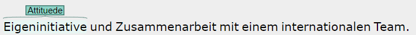
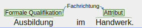
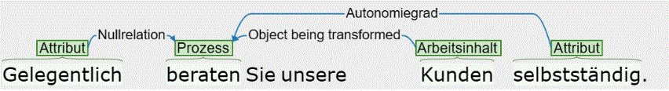
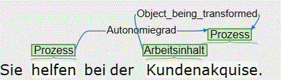
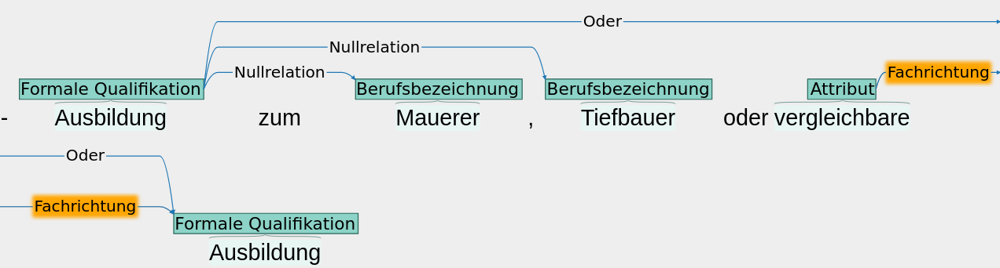
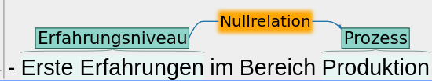
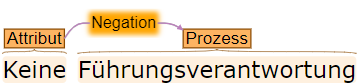

# Einführung
Der Annotationsguide beschäftigt sich damit, Informationen zu Skills, Tasks, Berufen und Branchen in Stellenanzeigen zu finden. Hierfür markieren wir sogenannte *Entitäten* im Text der Stellenanzeigen und ziehen *Relationen* zwischen ihnen, um beispielsweise zu verstehen, mit welchem Arbeitsmittel ein bestimmter Arbeitsprozess ausgeführt wird. 

Unser zentrales Interesse ist die ausgeschriebene Position bzw. die dafür gesuchten Bewerber*innen. Eigenschaften, die sich bspw. auf das Unternehmen oder Arbeitsinhalte beziehen, sind nicht zu annotieren. Eine Ausnahme hiervon stellt die Entität Branche dar, die sich explizit auf das Unternehmen bezieht.

  
  <!-- 
Sie sind dynamisch. Wir sind ein dynamisches Startup. Sie sind selbstständig. Sie sichern eine selbstständige Lebensweise der Bewohner.
 -->

 

Die hier dargestellten Entitäten und Relation werden weiter unten ausführlicher behandelt. Die Beispiele sollen nur ein Grundverständnis unseres Vorgehens vermitteln. Im ersten Beispielsatz bezieht sich *dynamisch* auf eine Charaktereigenschaft, die eine potenzielle Bewerberin mitbringen soll. Dagegen bezieht sich dynamisch im zweiten Satz auf das Unternehmen, weshalb wir dynamisch in diesem Beispiel nicht annotieren. 

Das letzte Beispiel gibt einen Überblick, wie Entitäten mit Relationen verbunden sein können. Dazu wurden recht kleinteilig unterschiedliche Textteile markiert und miteinander verbunden, mit dem Ziel gleiche oder ähnliche Informationen aus unterschiedlichen Stellenanzeigen im Anschluss leichter in Verbindung zu bringen. Die Aufgabe eines potenziellen Bewerbers in dem Beispiel ist es, eine selbstständige Lebensweise einer bestimmten Personengruppe zu sichern -der Bewohner. In einer anderen Stellenanzeige könnte beispielsweise die Sicherung der selbstständigen Lebensweise von Patienten gefordert sein. Die kleinteilige Markierung von Textstellen und deren Relation erlaubt es uns zu verstehen, dass es in beiden Fällen um die Sicherung der selbstständigen Lebensweise geht und lediglich Unterschiede in der Personengruppe bestehen.  

# Hintergrundwissen zur Konzeptualisierung   

In Stellenanzeigen sind Tasks und Skills eng verwandt und können häufig als zwei Seiten einer Medaille verstanden werden (siehe auch Rodrigues et al. [2021](https://www.econstor.eu/bitstream/10419/231348/1/jrc-wplet202102.pdf)). Von Tasks kann man auf Skills schließen, umgekehrt aber nicht. Zum Beispiel wird eine Task zum Skill, wenn man "Sie können" davorsetzt. 

## Tasks
Die Extraktion von Tasks ist eines unserer zentralen Auswertungsziele. Allerdings werden diese *nicht direkt* im Text markiert, sondern bestehen normalerweise aus einem **Prozess** und einem **Arbeitsinhalt**[^1]. 
Technisch gesehen sind Tasks diskrete Einheiten von Arbeit, also Arbeitsaufgaben, die im Rahmen wirtschaftlicher Aktivität Inputs in Outputs transformieren (Autor [2013](https://labourmarketresearch.springeropen.com/articles/10.1007/s12651-013-0128-z), Rodrigues et al. [2021](https://www.econstor.eu/bitstream/10419/231348/1/jrc-wplet202102.pdf)). Tasks können unterschiedliche Granularitäten aufweisen, die unter anderem von der Komplexität und der Organisation von Arbeit abhängen (Rodrigues et al. 2021: 6). Tasks können nach ihrem Inhalt (WAS?), den Aufgaben zugrundeliegende Methoden (WIE?), und Arbeitsmittel (WOMIT?) klassifiziert werden (z.B.: Fana et al. [2023](https://oa.inapp.org/xmlui/handle/20.500.12916/4058)). Die Arbeitsnachfrage am Arbeitsmarkt richtet sich selten auf einzelne Tasks, sondern auf Berufe, die Tasks kohärent bündeln (Fernández-Macías, Bisello, [2022](https://doi.org/10.1007/s11205-021-02768-7)).

  
  <!-- 
Sie sägen Holz
 -->

Im Beispiel *Sie sägen Holz* setzt sich der Task aus dem **Prozess** *sägen* und dem **Arbeitsinhalt** *Holz* zusammen. Es ist das *Holz*, welches im Verlauf des **Prozesses** *sägen* eine Veränderung erfährt (es ist in Bretter oder Ähnliches zerschnitten). Daher wird zwischen dem **Prozess** *sägen* und dem **Arbeitsinhalt** *Holz* die Relation **object_being_transformed** gezogen. Eine detailliertere Beschreibung der einzelnen Entitäten und deren Relationen erfolgt weiter unten.

[^1]: Prozess und Arbeitsinhalt werden weiter unten ausführlicher beschrieben

## Skills
Auch Skill werden bei uns *nicht direkt* im Text markiert, sondern setzen sich aus der Kombination verschiedener Entitäten und deren Relationen zusammen. Wir definieren Skills als die Fähigkeit, eine bestimmte Task erfolgreich erledigen zu können. 

> „Skill can be generally defined as the ability to perform a task well.“

(Rodrigues 2021)

Dementsprechend kann ein Skill beispielsweise durch die Kombination eines **Erfahrungsniveaus**[^2] mit einem Task beschrieben werden, wie das folgenden Beispiel verdeutlicht.  

  
  <!-- 
Erfahrung im Programmieren mit Python
 -->

Der **Prozess** *Programmieren* und der **Arbeitsinhalt** *Python* bilden einen Task. In Kombination mit dem **Erfahrungsniveau** *Erfahrung* wird daraus ein Skill, nämlich die Fähigkeit in Python programmieren zu können.

[^2]: Die Entität **Erfahrungsniveau** wird weiter unten ausführlicher beschrieben

# Entitätstypen
Entitäten sind die Textstellen, die wir im Text annotieren. Die Entitäten werden in folgende Typen unterteilt:
## Prozess
Ein **Prozess** beschreibt die zu verrichtende Handlung oder Abfolge von Schritten, die erforderlich sind, um eine bestimmte [Task](#Tasks) zu erledigen.

  
  <!-- 
Sie versorgen und beraten Patienten
 -->

Erläuterungen

- Prozesse sind häufig (substantivierte) Verben. 

  
  <!-- 
Sie sägen Holz
 -->

 

- Prozesse können auch Teil eines Kompositums -eines zusammengesetzten Wortes- sein.

  
  <!-- 
Holzsägen
 -->

  

- Prozesse können miteinander verkettet sein, wobei der eine Prozess den Autonomiegrad des anderen angibt.

  
  <!-- 
Mitverantwortung für die Koordination und Absprache aller Arbeitsabläufe im Team
 -->

- Teilweise gibt es logische Verkettungen/Abfolgen von Prozessen. Diese werden jedoch nicht miteinander verkettet.

  
  <!-- 
Ermittlung der Kenndaten zur Feststellung der Art der Hörbeeinträchtigung
 -->

  
  <!-- 
Förderung der Lebenszufriedenheit der Bewohner durch eine individuelle und aktivierende Pflege und Betreuung
 -->

<ul> <li> Beinhaltet ein Satz/eine Phrase einen inhaltsleeren Prozess, wie <i>durchführen</i> oder <i>arbeiten</i>, wird dieser nicht annotiert, wenn sich aus dem eigentlichen Arbeitsinhalt des Satzes ein Prozess ableiten lässt. Dies ist der Fall, wenn sich aus dem Wort ein Verb ableiten lässt, dass sich in die gängigen Taskkategorie, wie z.B. manuell/kognitiv, einsortieren lässt. Anderenfalls handelt es sich um einen Arbeitsinhalt und der inhaltslose Prozess ist mitzuannotieren, damit die Relationen <b>Arbeitsmittel</b> bzw. <b>object_being_transformed</b> gezogen werden können. </li>

  
  <!-- 
Sie führen Mitarbeitergespräche durch
 -->

  
  <!-- 
Sie führen Vertragsverhandlungen durch
 -->

<ul> <li> In den beiden Beispielen trägt <i>führen ... durch</i> nicht zu einer Konkretisierung der dahinterliegenden Aufgabe bei. Aus <i>Gespräch</i> lässt sich der <b>Prozess</b> <i>sprechen</i> und aus <i>Verhandlungen</i> der <b>Prozess</b> <i>verhandeln</i> ableiten. Die eigentlichen Aufgaben in den Beispielen sind daher das Sprechen mit Mitarbeitern und das Verhandeln von Verträgen. </li> 

<li>Durch das Weglassen inhaltsleerer <b>Prozesse</b> kann es auch dazu kommen, dass ein Satz nur über einen <b>Prozess</b> und keinen <b>Arbeitsinhalt</b> verfügt, wie die folgenden drei Beispiele belegen. </li> 

  
  <!-- 
Sie führen Analysen durch
 -->

  
  <!-- 
Veranstaltungen durchführen
 -->

  
  <!-- 
Vermessungsarbeiten
 -->

<li> Aus <i>Analysen</i> lässt sich der <b>Prozess</b> <i>analysieren</i> ableiten, aus <i>Veranstaltungen</i> der <b>Prozess</b> <i>veranstalten</i> und aus <i>Vermessung</i> der <b>Prozess</b> <i>vermessen</i>. Da die Annotation auf Wortebene anstatt auf Zeichenebene etwas leichter von der Hand geht, darf im letzten Beispiel <i>Vermessungsarbeiten</i> komplett annotiert werden, obwohl das <i>arbeiten</i> in diesem Fall nicht annotiert werden müsste, da es sich um einen inhaltsleeren <b>Prozess</b> handelt und sich aus <i>Vermessung</i> der Prozess <i>vermessen</i> ableiten lässt. Anders sieht es im nächsten Beispiel aus: </li> 

  
  <!-- 
Metallarbeiten
 -->

<li> Zwar handelt es sich bei <i>arbeiten</i> wiederum um einen inhaltsleeren <b>Prozess</b>, da sich jedoch aus <i>Metall</i> kein <b>Prozess</b> ableiten lässt, muss <i>arbeiten</i> weiterhin als <b>Prozess</b> und <i>Metall</i> als <b>Arbeitsinhalt</b> annotiert werden. Das Gleiche gilt für das folgende Beispiel: </li> 

  
  <!-- 
Sie arbeiten mit Excel
 -->

 

<li>
  Ebenfalls muss das inhaltslose Wort <i>Durchführen</i> annotiert werden, wenn noch andere Prozesse auf den gleichen Arbeitsinhalt referenzieren und sonst nicht klar wird, dass der Task auch durchzuführen ist. 

  
  <!-- 
Planung, Durchführung und Dokumentation der Pflege
 -->

 
  
</li>
</ul></ul>

- Prozessverben können in manchen Fällen durch abgetrennte Präfixe auf mehrere Wörter verteilt sein. In diesen Fällen werden alle Wörter als Prozess markiert und entsprechend über die Relation **zusammengehörige Entitätsteile** verbunden.

  
  <!-- 
Sie helfen bei der Beratung von Kunden mit
 -->

- Bei koordinierten Verben, die zwei unterschiedliche Prozesse darstellen, werden diese getrennt annotiert und über die Relation **Koordination** verbunden.

  
  <!-- 
Sie be- und entladen LKWs.
 -->

 

- Prozesse können auch Adjektive sein, die von Verben stammen und häufig in Verbindung mit einem inhaltsleeren Füllwort wie _Arbeiten_ oder _Tätigkeiten_ stehen 

  
  <!-- 
Zu ihren Aufgaben zählen administrative Tätigkeiten.
 -->

 

- Wenn Prozesse wie bei [Task](#task) beschrieben ohne Arbeitsinhalt vorkommen, stehen sie häufig alleine oder in Verbindung mit einem Attribut 

  
  <!-- 
Ausgangslagerung
 -->

 

- **Ansprechpartner** wird im nachfolgenden Beispiel als Prozess annotiert, da sich **Ansprechpartner sein** in gängige Taskdimensionen einordnen lässt. Gleiches gilt beispielsweise auch für Vorstandstätigkeit.

  
  <!-- 
Sie sind Ansprechpartner für Neukunden
 -->

 

  
  <!-- 
Vorstandstätigkeiten
 -->

- Wir gehen davon aus, dass eine Auflistung von Prozessen grundsätzlich unvollständig ist. Daher werden Formulierungen wie "weitere berufstypische Aufgaben" nicht annotiert.
  

## Arbeitsinhalt
Ein **Arbeitsinhalt** beschreibt alle weiteren Entitäten, die neben dem **Prozess** erforderlicher Teil einer **Task** sind, um diese ausreichend konkret von anderen Tasks abgrenzen zu können. Dabei werden über den **Arbeitsinhalt** zwei Dimensionen von **Tasks** abgebildet: _Womit wird gearbeitet?_ und _an was oder mit wem wird gearbeitet_? Ein Arbeitsinhalt kann einerseits ein Arbeitsmittel (*womit*) und andererseits ein (immaterieller) Gegenstand bzw. eine Person(engruppe) sein, der/die "bearbeitet" wird (*"an was" oder "mit bzw. an wem" wird gearbeitet*). 

  
  <!-- 
Sie pflegen Patienten
 -->

<figure style="text-align:center;">
  
  <!-- 
Sie bedienen Kunden
 -->
</figure>

  
  <!-- 
Du verkaufst Baumaschinen
 -->

  
  <!-- 
Sie bedienen Baumaschinen
 -->

Die ersten drei Sätze sind Beispiele für *"an was" oder "mit bzw. an wem"* wird gearbeitet. Dies wird durch die Relation **object_being_transformed** verdeutlicht, auf die im Kapitel zu [Relationen](#Relationstypen) detaillierter eingegangen wird. Der letzte Satz gibt ein Beispiel *womit* gearbeitet wird. Ein Vergleich der Sätze drei und vier zweigt, dass ein Wort in dem einen Kontext ein **Arbeitsmittel** und in dem anderen ein **object_being_transformed** sein kann. In Satz drei wird an dem Verkauf der Baumaschinen gearbeitet, wohingegen in Satz vier die Baumaschine genutzt wird, um etwas anderes zu erstellen. 

 

Erläuterungen

- Arbeitsinhalte bestehen in der Regel aus einem Wort oder einem feststehenden Mehrwortausdruck wie z.B. _MS-Office_. Zusatzinformationen werden als Attribut ergänzt. 

  
  <!-- 
Versorgung von Menschen mit Demenz. Versorgung von Menschen mit Behinderung. Sie akquirieren Neukunden. Sie akquirieren neue Kunden.
 -->

 

- Arbeitsinhalte sind häufig Satzobjekt oder Teil eines Kompositums - eines zusammengesetzten Wortes.

  
  <!-- 
Du bedienst Kunden
 -->

 

  
  <!-- 
Holzsägen
 -->

  

- Arbeitsinhalte werden normalerweise über die Relationen **Arbeitsmittel** oder **OBT (Object Being Transformed)** mit einem **Prozess** verbunden.

  
  <!-- 
Sie pflegen unsere Daten mit SQL
 -->

 

- Standards und Konzepte sind Arbeitsmittel und daher Arbeitsinhalt.

  
  <!-- 
Umsetzen des Sicherheitskonzepts nach Leitlinie A43
 -->

 

- Sprachkenntnisse: Die Sprache wird als Arbeitsinhalt mit der Relation Arbeitsmittel annotiert, analog zu Konzepten oder Standards.

  
  <!-- 
Deutschkenntnisse
 -->

 

  
  <!-- 
Deutsch fließend in Wort und Schrift
 -->

 

- Verfahren: Verfahren sind Arbeitsinhalte, die mit Nullrelation auf Prozesse gemappt werden. 

  
  <!-- 
Erfahrung im MAG-Schweißen
 -->

 

- Zur Abgrenzung zwischen Arbeitsinhalten und Attributen

  
  <!-- 
Wir suchen im Auftrag eines Logistikunternehmens eine/n Administrator/in für den Bereich Wareneingang von Konserven
 -->

 

  
  <!-- 
Facility Manager mit Schwerpunkt Gartenpflege
 -->

Im obigen Beispiel wird **Wareneingang** als Arbeitsinhalt annotiert, weil es sich auf die konkrete Stelle bezieht, wohingegen **Gartenpflege** als Attribut annotiert wird, weil es sich auf den Beruf und nicht unbedingt die konkrete Stelle bezieht.

- In Ausnahmefällen können Attribute und Arbeitsinhalte zusammengefasst werden, wenn der Arbeitsinhalte ansonsten keinen oder kaum Inhalt tragen würde. In unten stehendem Beipiel ist *Techniken* viel zu allgemein. Erst durch die Verbindung mit *mikroskopische* wird ersichtlich, welche Fähigkeiten damit verbunden sind. 

  
  <!-- 
Kenntnisse über mikroskopische Techniken
 -->

- Sobald in einem Wort ein Prozess und ein Arbeitsinhalt genannt ist, wird versucht diese separat zu annotieren. Im folgenden Beispiel wäre es daher falsch das gesammte Wort *Kontaktpflege* als Prozess anzusehen.

  
  <!-- 
Kontaktpflege und Informationsaustausch mit den Angehörigen unserer KundenInnen
 -->

## Attribut
Ein **Attribut** spezifiziert eine andere Entität näher.

  
  <!-- 
Gelegentlich beraten Sie unsere Kunden selbstständig
 -->

Erläuterungen

- Ein Attribut kann nicht alleinstehen.
- Eine Entität ist nur ein Attribut, wenn die entsprechende andere Entität allein für sich stehen kann. Im Beispiel stellt "naturwissenschaftliches Studium" für sich eine formale Anforderung dar. _Abgeschlossenes_ und _wünschenswert_ beschreiben die Art der Qualifikation nur noch detaillierter. 

  
  <!-- 
Abgeschlossenes naturwissenschaftliches Studium wünschenswert
 -->

 

- Attribute werden nicht miteinander verkettet (außer die Relation ist Detail).

  
  <!-- 
Erfahrung mit gängigen Schweißverfahren u.a. Warmgasstumpfschweißen
 -->

  

- Attribute können daher auch längere Spans mit Zusatzinformationen sein, wenn sich diese nicht trennen lassen.

  
  <!-- 
Sägen von Holz für unsere Kunden im Bereich Holzverarbeitung mit Schwerpunkt Möbelbau
 -->

 

- Bei Attributen mit Nullrelation werden Präpositionen (falls vorhanden) mit annotiert, um den Sinn zu erhalten. Im nachfolgenden Beispiel das Wort **für**.

  
  <!-- 
Du entwirfst Werbeanzeigen für ausgewählte Produkte
 -->

 

- Attribute binden in der Regel nur auf eine Entität. In diesem Falll auf den Prozess *Austausch*, auch wenn man in diesem Fall davon ausgehen kann, dass die Kontaktpflege ebenfalls mit den Angehörigen stattfindet.

  
  <!-- 
Kontaktpflege und Informationsaustausch mit den Angehörigen unserer KundenInnen
 -->

 

## Erfahrungsniveau
Das **Erfahrungsniveau** gibt an, welche Art von Erfahrung ein potenzieller Arbeitnehmer im Beruf allgemein oder für eine bestimmte **Task** mitbringen muss.
  

  
  <!-- 
Erfahrung im Programmieren mit Python
 -->

Erläuterungen

- Das Erfahrungsniveau kann sich auf den Job als Ganzes oder einzelne Tasks beziehen 

  
  <!-- 
Berufserfahrung
 -->

 

  
  <!-- 
Berufserfahrung als Ingenieur
 -->

 

- Das Erfahrungsniveau wird typischerweise über Nomen (z.B. Kenntnisse, Erfahrung) oder Verben (z.B. können, verstehen) ausgedrückt.
  

  
  <!-- 
Sie können bereits Blut abnehmen?
 -->

- Zur Span des Erfahrungsniveau gehören auch Adjektive, die auf die Qualität der Erfahrung hinweisen.

  
  <!-- 
sehr gute Kenntnisse in der Erarbeitung von Workflows
 -->

  

  
  <!-- 
Erste Erfahrung im Umgang mit Photovoltaik-Anlagen
 -->

  

- Falls diese Adjektive nicht unmittelbar vor _Erfahrung, Kenntnisse etc._ stehen, werden sie über die Relation **ZET** verbunden

  
  <!-- 
Hervorragende STATA-Kenntnisse
 -->

  
  <!-- 
Sehr gute Stata und gute R-Kenntnisse
 -->

## Attitüde 
Eine **Attitüde** bezieht sich auf die geistige Ausrichtung, Haltung, Einstellung oder Überzeugung, die eine Person gegenüber einer bestimmten Idee, Aufgabe oder Situation hat und schließt auch persönliche Eigenschaften wie Talente mit ein.
  

  
  <!-- 
Sie sind teamfähig
 -->

Erläuterungen

  
- Verstärker von Attitüden wie z.B. *sehr gute*, *gute*, *hohe* werden als Attribut annotiert.

  
  <!-- 
gute Auffassungsgabe
 -->

-  Arbeiten im Team wird dagegen nicht als Attitüde annotiert, da es sich eher um einen Arbeitsumstand als um eine Attitüde handelt
  

  
  <!-- 
Eigeninitiative und Zusammenarbeit mit einem internationalen Team
 -->

- Wörter wie _Arbeitsweise_ und _Arbeit_ sind Worthüllen, die häufig eingesetzt werden, um eine Attitüde auszudrücken (z.B. _strukturierte Arbeitsweise_). Sie werden nicht mitannotiert. 

  
  <!-- 
Sie arbeiten strukturiert und haben eine analytische Arbeitsweise.
 -->

 

- Adjektive wie _selbständig_ oder _kooperativ_ können sowohl als Attribut und als Attitüde auftreten. Wenn sie die Person oder deren Arbeit im Ganzen meinen, sind es Attitüden. Wenn sie sich hingegen auf einen Prozess beziehen, sind es Attribute, die den Autonomiegrad des Prozesses angeben. 

  
  <!-- 
Sie sind selbstständig
 -->

  
  <!-- 
Sie werben selbstständig Neukunden an
 -->

- Jede Form von Bereitschaft ist eine Attitüde, weil mit dem Wort _Bereitschaft_ die Haltung oder Einstellung der gesuchten Person beschrieben wird.

  
  <!-- 
Bereitschaft zu Schichtdienst und Wochenendarbeit. Leistungsbereitschaft. Bereitschaft zu mehrtägigen Reisen wir vorausgesetzt. Sie zeigen stets Kooperationsbereitschaft
 -->

- Davon ausgenommen ist der _Bereitschaftsdienst_, weil es sich hier nicht um eine innere Haltung, sondern um eine Arbeitsform handelt.

  
  <!-- 
Ihre Aufgaben: Bereitschaftsdienst
 -->

- Belastbarkeit ist eine Attitüde. Die jeweilige Art der Belastbarkeit (im Beispiel *körperliche*) wird als Attribut annotiert

  
  <!-- 
Körperliche Belastbarkeit
 -->

- Verständnis drückt oft eine Attitüde aus, wobei das Adjektiv essenziell ist, um die Attitüde klassifizieren zu können. Es wird daher nicht als Attribut verstanden, sondern als Teil der Attitüde mitannotiert.  

  
  <!-- 
technisches Verständnis
 -->

- Interesse an einer Task (Prozess + Arbeitsinhalt) ist eine Attitüde

  
  <!-- 
technisches Verständnis
 -->

## Berufsbezeichnung
Eine **Berufsbezeichnung** benennt einen Beruf. Wir nutzen den Entitätstyp sowohl für **Professionen und erlernte Berufe** als auch **Stellungen im Betrieb** 
  

  
  <!-- 
Wir suchen eine/n Bäcker/in
 -->

Erläuterungen

- Es sollen keine Quantifizier annotiert werden, die ausdrücken, wie viele Personen gesucht werden, also nur _Maurer_ und nicht _einen Maurer_.
- Die Zeichenkette von Berufsbezeichnungen soll so kurz wie möglich gehalten werden. Bei genderneutralen Formulierungen wird immer die kürzeste Variante annotiert, also nur _Maurer_ in der Zeichenkette _Maurer/in_, bzw. _Angestellte_ in _Angestellte/r_.

  
  <!-- 
Wir suchen eine/n Maurer/in (m/w/d)
 -->

 

- Es werden auch Berufsbezeichnungen annotiert, die nicht zwingend der ausgeübte Beruf in der ausgeschriebenen Stelle sind, wie z.B. solche, die im Kontext von Ausbildungsabschlüssen stehen.

  
  <!-- 
Sie haben eine abgeschlossene Ausbildung als Maurer
 -->

 

- Auch Wörter, die die **Stellung im Betrieb**, wie _Mitarbeiter_, _Fachkraft_, _Leiter_ usw. werden als Berufsbezeichnung annotiert. Sie werden oft von einem Attribut begleitet, welches die fachliche Komponente des Berufs beschreibt. 

  
  <!-- 
Wir suchen einen Mitarbeiter im Accounting
 -->

  
  <!-- 
Stelle als Leiter im Vertrieb
 -->

- Fachliche Berufsbezeichnungen können aber auch mit denen, die die Stellung angeben, verkettet sein

  
  <!-- 
Wir suchen einen Informatiker als Teamleiter
 -->

 

- Bei koordinierten Berufsbezeichnungen werden diese immer getrennt als Koordination und nicht als eine Entität annotiert, auch wenn es sich dabei inhaltlich um einen Beruf handelt (wie bei _Beton- und Stahlbetonbauer_)

  
  <!-- 
Wir suchen Beton- und Stahlbetonbauer sowie Alten- oder Kinderkrankenpfleger
 -->

## Branche
Die **Branche** bezieht sich auf den Wirtschaftszweig des Unternehmens, bei dem die Stelle angesiedelt ist. Diese stimmt nicht notwendigerweise mit der Branche des inserierenden Unternehmens überein (z.B. bei Arbeitsvermittlung bzw. Arbeitnehmerüberlassung).
Häufig findet sich diese Information in der Unternehmensbeschreibung.

  
  <!-- 
Berufserfahrung in der Lebensmittelindustrie
 -->

Erläuterungen

- Unternehmenstypen, wie beispielsweise _Friseur_, _Schule_ oder _Werbeagentur_ werden ebenfalls als Branche annotiert.

  
  <!-- 
Für unsere Schneiderei suchen wir eine Bürofachkraft.
 -->

 

  
  <!-- 
Wir suchen einen Mitarbeiter für die Metallindustrie
 -->

 

- In einigen Fällen weichen Branche und Arbeitsort ebenfalls voneinander ab. Hier hilft die Frage, in welche (Betriebs-)Organisation die Stelle primär eingebunden ist.

  
  <!-- 
Sie arbeiten in einem Foodtruck auf Festivals und Stadtfesten.
 -->

 

- Abweichend vom sonstigen Vorgehen, wird die Entität **Branche** immer für ein ganzes Wort markiert, auch wenn ein Wortteil schon reichen würde, um die Branche zu identifizieren. Dies soll die Annotationsarbeit erleichtern.

  
  <!-- 
In unserem Logistikunternehmen bist du zuständig für ... Wir sind ein Unternehmen in der Logistikbranche und suchen Speditionskaufleute
 -->

  
  <!-- 
Architekturbüro
 -->
  

 

- Eigennamen, wie beispielsweise Namen von Organisationen, werden nicht als Branche annotiert, auch wenn man daraus den Wirtschaftszweig lesen könnte.

  
<i>DHL</i> sucht neue Fahrer/innen.
 
  
Wir suchen im Namen der <i>RheinEnergie</i> neue Mitarbeiter/innen.
 

 

- Textstellen, die den allgemeinen Charakter des Arbeitsorts beschreiben (z.B. _draußen_, _im Freien_, _in der Halle_, _zuhause_) werden nicht annotiert

## Formale Qualifikation
Eine **formale Qualifikation** wird normalerweise von einer Institution wie einer IHK, Handelskammer, Universität, einer Fachschule oder einer Zertifizierungsstelle ausgestellt und dient als offizieller Nachweis für den Arbeitgeber oder andere Interessierte, dass eine Person über das erforderliche Wissen und die erforderlichen Fähigkeiten verfügt, um eine bestimmte Tätigkeit auszuführen. Für die Annotation spielt es jedoch keine Rolle wie "offiziell" die Zertifizierungsstelle ist. Es reicht, dass der AG sie nennt. 
  

  
  <!-- 
Sie haben eine abgeschlossene Ausbildung zum Softwareentwickler 
 -->

Erläuterungen

- Es wird nur die Art der Qualifikation als Entität formale Qualifikation markiert. Die Details wie die Fachrichtung werden über andere Entitäten und Relationen abgebildet.
- Signalwörter für eine formale Qualifikation sind z.B. _Studium_, _Ausbildung_, _Abschluss_ oder _Führerschein_.

  
  <!-- 
Studium der Sozialwissenschaften
 -->

  
  <!-- 
Ausbildung im Handwerk.
 -->

  
  <!-- 
Gabelstaplerschein
 -->

  
  <!-- 
Projektmanagementzertifikat
 -->

  
  <!-- 
LKW-Führerschein
 -->

  
  <!-- 
Führerschein
 -->

- Wenn eine genaue Führerscheinklasse angegeben ist, ist diese als Attribtut zu annotieren. Wäre ausschließlich PKW genannt, wäre dieser als Attribut zu annotieren. Es sei denn, aus der Anzeige geht eindeutig hervor, dass es sich bei dem PKW um ein Arbeitsmittel handelt (z.B. bei einem ambulaten Pflegedienst)

  
  <!-- 
Fahrerlaubnis B PKW/Kleinbusse (alt: FS 3)
 -->

## Task

- Es gibt Fälle, bei denen Tasks formuliert sind, diese sich aber nicht in Prozess und Arbeitsinhalt aufteilen lassen. In solchen Fällen können Prozesse/Arbeitsinhalte auch alleinstehen bzw. mit der Nullrelation an andere Entitäten gekoppelt sein. Arbeitsinhalt ist hierbei oft so eine Art Kompetenzbereich. Um in solchen Fällen AI von Prozessen abzugrenzen, greift hier die Faustregel: Kann ich die Span als Task weiter inhaltlich klassifizieren (z.B.: physische/manuelle, intellektuelle/kognitive, soziale Task)? Ist dies der Fall, liegt ein Prozess vor analog zum Vorgehen bei inhaltslosen [Prozessen](#Prozess). Ist dies nicht der Fall, liegt ein AI vor. In den Beispielen unten z.B. lässt sich "Bädertechnik" nicht weiter klassifizieren, da nicht klar ist, ob manuelle oder kognitive oder sonstige Tasks hiermit verbunden werden. Im Gegensatz dazu deutet *Lagerung* auf einen Prozess hin, wobei *Ausgang* nicht das ist, was gelagert wird (expliziter wäre die Formulierung z.B. so: "Sie lagern Ware für den Ausgang"). Daher wird *Ausgang* als [Attribut](#Attribut) annotiert.

  
  <!-- 
Bädertechnik
 -->

 

 

  
  <!-- 
Ausgangslagerung
 -->

 

# Relationstypen
Relationen bilden Beziehungen zwischen Entitäten ab. Bei Relationen können folgende Typen unterschiedenen werden:
## Object being transformed (OBT)
Das **Object being transformed** ist ein Gegenstand, eine Person oder ein Gedanke, der/die mit einem **Prozess** hergestellt, transformiert, bearbeitet oder adressiert wird.

  
  <!-- 
Sie hacken Holz.
 -->

  
  <!-- 
Sie betreuen Kinder.
 -->

Erläuterungen

- Diese Relation stellt dar, dass _ein **Prozess** auf einen **Arbeitsinhalt** angewandt_ wird. Der Arbeitsinhalt kann dabei ein Gegenstand, eine Person(engruppe) oder ein Gedanke sein.

  
  <!-- 
Sie unterrichten Kinder.
 -->

 

- In einigen Fällen kann auch eine verkürzte Form auftreten, sodass nur ein Erfahrungsniveau zusammen mit einem Arbeitsinhalt genannt wird. Anhand der Art des Arbeitsinhalts bzw. des Kontexts muss dann entschieden werden, ob es ein **OBT** oder ein **Arbeitsmittel** ist.

  
  <!-- 
Sie haben Erfahrung mit Kindern.
 -->

  

## Arbeitsmittel
Ein **Arbeitsmittel** ist das Werkzeug, die Software oder das Konzept, mit deren Hilfe ein **Prozess** durchgeführt wird.

  
  <!-- 
Sie pflegen den Mitarbeiterstamm mittels SAP
 -->

Erläuterungen

- Diese Relation stellt dar, dass _in einem **Prozess** ein **Arbeitsinhalt** eingesetzt_ wird. Der Arbeitsinhalt ist dabei typischerweise ein Werkzeug, eine Software oder ein Konzept/Standard.

  
  <!-- 
Sie bedienen CNC-Fräsen
 -->

 

- Konzepte, Normen und Standards sind Arbeitsmittel, sobald sie in einem Prozess _eingesetzt_ werden.

  
  <!-- 
Sie kontrollieren die Funktionen nach ISO 26262.
 -->

 

- Wie beim **OBT** kann auch hier eine verkürzte Form aus Erfahrungsniveau und Arbeitsinhalt auftreten. Anhand der Art des Arbeitsinhalts bzw. des Kontexts muss auch hier entschieden werden, ob es ein **OBT** oder ein **Arbeitsmittel** ist.

  
  <!-- 
Erfahrung mit JavaScript
 -->

 

## Autonomiegrad
Die Relation **Autonomiegrad** drückt aus, dass eine Entität (häufig ein **Attribut** oder **Prozess**) den Autonomiegrad einer anderen Entität spezifiziert.

  
  <!-- 
Gelegentlich beraten Sie unsere Kunden selbstständig
 -->

Erläuterungen

- Der Autonomiegrad gibt an, wie autonom (d.h. selbstständig) ein Prozess durchgeführt wird. Autonomie kann sprachlich durch (substantivierte) Verben und durch Adjektive vermittelt werden.
- Adjektive wie _selbstständig_, _unterstützend_ oder _eigenverantwortlich_ werden als **Attribut** markiert und über **Autonomiegrad** mit dem **Prozess** verbunden.

  
  <!-- 
Sie akquirieren selbstständig Neukunden
 -->

 

- Der Autonomiegrad liegt nur dann vor, wenn etwas explizit von der "Norm", dass man es selber macht, abweicht. Das Verb *durchführen* beispielsweise deutet darauf hin, dass die Person die Aufgabe selbst macht. Dasselbe gilt aber, wenn kein expliziter Hinweis auf den Autonomiegrad vorliegt. Es gibt hinsichtlich des Autonomiegrads für uns keinen Unterschied zwischen *analysieren* und *Analysen durchführen*.
  

  
  <!-- 
Sie analysieren
 -->

  
  <!-- 
Sie führen Analysen durch
 -->

- Verben wie _helfen_, _unterstützen_ oder _verantworten_ werden als **Prozess** markiert und mit dem anderen **Prozess** über **Autonomiegrad** verbunden. Achtung: dies gilt nur, wenn ein zweiter Prozess vorliegt. Bei _Sie helfen Patienten_ stellt das Helfen selbst einen eigenständigen Prozess dar.

  
  <!-- 
Sie helfen bei der Kundenakquise.
 -->

## Fachrichtung
Die **Fachrichtung** zeigt an, dass eine Entität, häufig ein **Attribut**, eine Spezifizierung der fachlichen Ausrichtung einer Entität wie **formale Qualifikation** oder **Berufsbezeichnung** darstellt.
  

  
  <!-- 
Wir suchen einen Fachinformatiker Systemintegration
 -->

Erläuterungen

- Eine Fachrichtung gibt sowohl die inhaltliche Ausrichtung einer formalen Qualifikation als auch die nähere fachliche Spezialisierung eines Berufs an.

  
  <!-- 
Berufserfahrung in der Lebensmittelindustrie
 -->

  
  <!-- 
Wir suchen eine Facility Manager mit Schwerpunkt Gartenpflege.
 -->

 

- Es liegt **keine** Fachrichtung vor, wenn eine formale Qualifikation mit einer konkreten Berufsbezeichnung verbunden wird. Nur, wenn die Berufsbezeichnung noch durch (inhaltliche) Schwerpunkte näher beschrieben wird, wird zwischen Berufsbezeichnung und der Schwerpunktbeschreibung die Relation **Fachrichtung** gebildet. Außerdem wird die Relation **Fachrichtung** annotiert, wenn keine konkrete Berufsbezeichnung genannt wird, sondern sich die formale Qualifikation über einen breiteren Bereich (z.B. _kaufmännisch_) verteilt. 

  
  <!-- 
Ausbildung zum Informatiker mit Schwerpunkt Systemintegration. abgeschlossene kaufmännische Ausbildung.
 -->

 

- Wörter, die Teil einer Fachrichtung sind, werden zusammen annotiert

  
  <!-- 
Gärtner (Garten- und Landschaftsbau).
 -->

 

- Bei Formulierungen wie _vergleichbare Ausbildung_ ist _vergleichbar_ die Fachrichtung 

  
  <!-- 
Ausbildung zum Mauerer, Tiefbauer oder vergleichbare Ausbildung.
 -->

 

## Detail
Bei einer Detailrelation spezifiziert eine Entität eine andere Entität, wobei die beiden Entitätstypen normalerweise identisch sind.
  

  
  <!-- 
Erfahrung mit MS-Office (Excel, Word)
 -->

 

Erläuterungen

- Details treten auf, wenn zu einer Entität noch weitere Unterentitäten genannt werden, die die ursprüngliche Entität näher spezifizieren.
- Bei einer Detail-Relation müssen in der Regel beide Entitäten den gleichen Typ haben.
- Signale für **Detail** sind _z.B._, _u.a._, _beispielsweise_, _insbesondere_ oder auch Nennungen in Klammern.

  
  <!-- 
Kenntnisse in den Schweißfachverfahren MIG / WIG / MAG.
 -->

 

## Oder
Die **Oder** Relation wird zwischen Entitäten gezogen, die als Alternativen in einer Stellanzeige aufgeführt sind.
  

  
  <!-- 
Sie verfügen über eine Ausbildung zum Maurer oder Dachdecker.
 -->

 

Erläuterungen

- Bei mehreren Alternativen, wird immer nur die maximalst niedrige Anzahl an Alternativ-Relationen gezogen. Die anderen werden später inferiert. A->B und B->C, sodass A->C inferiert wird. 

  
  <!-- 
Sie haben einen Master in BWL, VWL oder IBS.
 -->

 

- Die Relation **oder** wird nur dann gezogen, wenn explizit ableitet werden kann, dass es sich um Alternativen handelt, z.B. durch die Verwendung des Wortes **oder** oder **bzw.**. Bei anderen Arten der Auflistung z.B. durch **/** oder **,** getrennt, werden die Entitäten nur einzeln annotiert und keine **oder-Relation** gezogen, da nicht ausgeschlossen werden, kann dass es sich um eine *und*-Verkettung der Entitäten handeln könnte. 

  
  <!-- 
Maurer/Betonbauer/Bauhelfer gesucht
 -->

 

  
  <!-- 
Maurer, Betonbauer, Bauhelfer gesucht
 -->

 

  
  <!-- 
Maurer, Betonbauer oder Bauhelfer gesucht
 -->

 

  
  <!-- 
Studium als Ingenieur der Sicherheitstechnik bzw. anderer Fachrichtungen wie z.B. Verfahrenstechnik
 -->

## Dringlichkeit
Die **Dringlichkeit** gibt an, wie wichtig eine Entität (meist **Formale Qualifikation** oder **Erfahrungsniveau**) für die ausgeschriebene Stelle ist.

  
  <!-- 
Ausbildung zum Bäcker wünschenswert.
 -->

Erläuterungen

- Attribute, die ausdrücken, wie wichtig eine Entität (meist **Formale Qualifikation** oder **Erfahrungsniveau**) für die Bewerbung ist, werden über die Relation **Dringlichkeit** verknüpft.

  
  <!-- 
Programmierkenntnisse zwingend erforderlich.
 -->

## Negation
Die **Negation**-Relation wird verwendet, wenn ein Prozess oder ein Arbeitsinhalt explizit nicht Teil der Stelle ist. Das negierende Element wird als Attribut mit dem Prozess als **Negation** verknüpft.

  
 <!-- 
Ihre Tätigkeit umfasst keine Pflege.
 -->

Erläuterungen

- Davon abgegrenzt werden negierte Qualifikationen oder Erfahrungsniveaus als **Dringlichkeit** annotiert.

  
 <!-- 
Erfahrung in der Wärmepumpeninstallation nicht notwendig.
 -->

  
 <!-- 
Reisebereitschaft nicht erforderlich
 -->

- Negationen können auch positiv formuliert sein.

  
  <!-- 
Sie sind von der Pflege freigestellt
 -->

## Nullrelation
Keine nähere Spezifizierung der Relation zwischen zwei Entitäten notwendig/vorhanden.
  

  
  <!-- 
Ausbildung zum Bäcker wünschenswert.
 -->

Erläuterungen

Keine nähere Spezifizierung der Relation zwischen zwei Entitäten notwendig/vorhanden. Diese Relation wird verwendet, wenn zwischen zwei Entitätstypen nur eine Art von Relation möglich ist. Dies dient vor allem der Annotationserleichterung.

  
  <!-- 
Ausbildung zum Bäcker wünschenswert.
 -->

## Sprachliche Relationen
Diese Relationen dienen dazu, mit bestimmten sprachlichen Eigenheiten umgehen zu können:

### zusammengehörige Entitätsteile (ZET)
Diese Relation wird dazu verwendet, um Wörter oder Wortteile zu verbinden, die gemeinsam eine Entität bilden, aber syntaktisch voneinander getrennt sind.
  

  
  <!-- 
Sie geben den Monatsplan vor.
 -->

Erläuterungen

Die Wörter müssen dabei zusammen kein eigenständiges Wort bilden. Es geht eher darum, dass sie die Entität semantisch abbilden.

  
  <!-- 
Es ist kein Studium notwendig.
 -->

### Koordination
Diese Relation wird verwendet, wenn durch (Morphem-)Koordination der Teil eines Wortes weggelassen wird. 
  

  
  <!-- 
Sie be- und entladen LKWs.
 -->

Erläuterungen

  
  <!-- 
Du belegst Käse- und Wurstbrötchen.
 -->

- Bei komplexeren Koordinationen verweisen alle koordinierten Wörter (**Information**, **Prozess**) auf das Wort, dass den weggelassenen Wortteil enthält (**Applikationsarchitekturen**). Weitere gemeinsame Relationen wie in dem Beispiel **Object being transformed** verweisen nur auf das "vollständige" Wort (**Applikationsarchitekturen**)

  
  <!-- 
Entwicklung von Informations-, Prozess und Applikationsarchitekturen
 -->

# Allgemeines

- Sich wiederholende Informationen oder sich widersprechende Informationen werden immer annotiert. Wenn beispielsweise erst die freie Position eines Bäckers beschrieben wird und weiter unten im Text die Position einer Verkaufskraft beschrieben wird, werden beide Informationen annotiert.
- Informationen aus "strukturierten" Textfeldern sollen annotiert werden, wenn eindeutig differenziert werden kann, um welche Art von Information es sich handelt z.B. eine Auflistung des Berufs, Wirtschaftszweig, etc. Im Beispiel alle Information nach **Stellendetails**.

  

- Informationen aus Boilerplate soll nicht annotiert werden. Das betrifft z.B. den Fall, wenn Reste weiterer Stellenanzeigen aufgeführt werden (gelb markierter Teil).

  

## Allgemeine Regeln zu Entitäten 
- Entitäten werden immer als kleinstmögliche Sinneinheit annotiert. Das heißt, sie werden so knapp wie möglich, aber so lang wie nötig annotiert, um den Sinn zu erhalten. Relevante Zusatzinformationen können immer auch als Attribut annotiert werden. 
- Wörter wie _Schwerpunkt_, _Bereich_, usw. werden nicht mit annotiert. Die Bedeutung dieser Wörter wird über den Entitätstyp oder über Relationen abgebildet.

  
  <!-- 
Aufgaben im Bereich Marketing
 -->

 

- Präpositionen werden i.d.R. nicht mit annotiert. Die Bedeutung dieser Wörter wird über Relationen abgebildet. Eine Ausnahme bilden Attribute mit Nullrelation (Siehe [Attribut](#Attribut)).

  
  <!-- 
Du erstellst Werkzeuge für unsere Fertigungsmaschinen
 -->

 

- Beinhaltet ein Wort mehrere Entitäten, wird das Fugen-**S** dem ersten Nomen zugeordnet. In nachfolgenden Beispiel Applikation**s**.

  
  <!-- 
Applikationsbetreuung
 -->

 

### Unscharfe Informationen
Informationen in Stellenanzeigen zu Arbeitsaufgaben oder Anforderungen können teilweise unscharf, unvollständig, implizit oder vage formuliert sein. Nicht alle Informationen sind für die Extraktion relevant, daher stellen wir in Bezug auf unscharfe Informationen einige Regeln auf:

#### Unvollständige Auflistungen
Unvollständige Auflistungen treten sowohl bei der Beschreibung von Arbeitsaufgaben als auch bei Formulierung von Anforderungen auf.

- Wir gehen davon aus, dass Auflistungen von Arbeitsaufgaben nie vollständig sind. Formulierungen wie _und weitere/vergleichbare/ähnliche Aufgaben_ werden daher ignoriert und nicht annotiert

<!-- 
Pflege von Datenbanken und vergleichbare Aufgaben
 -->

 

- Eine Ausnahme bildet das folgende Beispiel, in dem **Erfahrungen in ähnlichen Aufgaben** eher als eine Art Berufserfahrung anzusehen ist

<!-- 
Du hast bereits Erfahrung in ähnlichen Aufgaben gesammelt
 -->

 

- Im Gegensatz zu Arbeitsaufgaben deuten Formulierungen wie *vergleichbare...* bei Qualifikationen und Skills auf eine gewisse Flexibilität bei der Stellenbesetzung hin. Diese Information betrachten wir als relevant und soll annotiert werden.

<!-- 
Studium oder vergleichbare Qualifikation
 -->

 

<!-- 
Erfahrungen in Java o.ä.
 -->

 

**Zusammenfassend sollen also unscharfe Informationen in Bezug auf Skills und Formale Qualifikationen annotiert werden und in Bezug auf Arbeitsaufgaben/Tasks ignoriert werden.**

#### Implizite Beschreibungen
In einigen Fällen sind Entitäten ohne weitere Kontextinformationen völlig unverständlich. Zum Beispiel kann _berufstypische Aufgaben_ semantisch nur aufgelöst werden, wenn man den jeweiligen Beruf kennt.

- Implizite Beschreibungen werden - soweit wie möglich - als Entitäten annotiert. Die inhaltliche Auflösung erfolgt in einem Schritt, der an die Annotation anschließt.

<!-- 
berufstypische Aufgaben
 -->

## Allgemeine Regeln zu Relationen
- Relations-Pfeile werden grundsätzlich immer von links nach rechts gezogen.

<!-- 
Beratung von Kunden. Kunden beraten.
 -->

- Eine Entität kann mit mehreren anderen Entitäten verknüpft sein. Im folgenden Beispiel wird jedes Prozess-Verb einzeln markiert und mit dem Arbeitsinhalt verbunden: 

  
  <!-- 
Sie versorgen und beraten Patienten.
 -->

 

- In manchen Fällen können [Konjunktionen](https://de.wikipedia.org/wiki/Konjunktion_(Wortart)) zu syntaktischer Ambiguität führen. Das heißt, dass nicht klar ist, auf wie viele Entitäten sich eine andere Entität bezieht. Im Beispiel kann sich _sehr_ nur auf _aufmerksam_ oder auch auf _engagiert_ beziehen. In diesen Fällen wird die fragliche Entität nur mit der ersten in Frage kommenden Entität verknüpft (siehe Annotation im Beispiel).

  
  <!-- 
Sie sind sehr aufmerksam und engagiert
 -->

 

- Bei [Koreferenzen](https://de.wikipedia.org/wiki/Koreferenz) innerhalb eines Satzes werden Relationen zum ursprünglichen Wort und nicht zum Pronomen gezogen. Im folgenden Beispiel könnte _verkaufen_ auch mit dem letzten _sie_ verbunden werden. Weil damit aber die Kisten gemeint sind, wird _verkaufen_ direkt mit _Kisten_ verknüpft.

  
  <!-- 
Sie packen Kisten und verkaufen sie.
 -->

 

### Verkettungen und Span-Längen
- Außer Attitüden stehen Entitätstypen in der Regel nicht allein. Vereinzelt kommen Arbeitsinhalte und Prozesse auch allein vor (siehe [taks](#task)).
- Reihenfolge der Relationen: Es kann manchmal mehrere Möglichkeiten geben, mehrere Relationen miteinander zu verketten. Für uns gilt: Wenn möglich erst auf Prozess mappen, ansonsten auf Arbeitsinhalt. 

  
  <!-- 
Kenntnisse im Programmieren von Python
 -->

  
  <!-- 
Interesse an der Kundenbetreuung
 -->

## Sonstiges
- Bildsprache wird nicht mit annotiert, es sei denn es handelt sich um eine Attitüde (z.B.  einen kühlen Kopf bewahren/ unterschiedliche Dinge im Blick behalten). Im folgenden Beispiel werden nicht der Prozess **knacken** und der Arbeitsinhalt **Nüsse** annotiert, sondern die gesamte Phrase als Attitüde. Anders wäre der Fall gelagert, wenn das Knacken von harten Nüssen eindeutig wortwörtlich Teil der Arbeitsaufgaben wäre.

  
  <!-- 
Sie knacken harte Nüsse
 -->

  
  <!-- 
einen kühlen Kopf bewahren
 -->

  
  <!-- 
unterschiedliche Dinge im Blick behalten
 -->

- Spans mit Tippfehlern oder grammatikalischen Fehlern werden trotzdem mit annotiert.

# Hilfsfragen
Während der Annotation sollen folgende Fragen eine Hilfestellung bieten, um Entitäts- und Relationstypen besser zu finden.
| Typ                    | Hilfsfrage           | 
| -------------------- |----------------------| 
| Prozess                | Was ist die Aktivität? |
| Arbeitsinhalt          | Mit wem, womit bzw. woran wird gearbeitet?      |
| Attribut               | Wird eine Entität mit einer Zusatzinformation näher beschrieben?      |
| Erfahrungsniveau       | Welche Art der Vorkenntnisse (inkl. Interesse) braucht man?|   
| Attitüde               | Welche Eigenschaften braucht man für den Job? |
| Berufsbezeichnung      | Wie heißt der gesuchte Beruf/die Stelle/Ausbildung laut Ausschreibung?|
| Branche                | In welchem Wirtschaftszweig operiert der Betrieb, bei dem die Stelle ausgeübt wird?|
| Formale Qualifikation  | Welche Art von Zertifikat ist gefordert?|
|                        |
| Object Being Transformed | An was/mit wem wird gearbeitet?|
| Arbeitsmittel            | Mittels welchen Instruments wird etwas bearbeitet? Womit wird der Prozess ausgeführt?|
| Autonomiegrad            | Wie (un-)eigenständig wird der Prozess ausgeführt?|
| Fachrichtung             | Wie wird die gesuchte Qualifikation/Berufsbezeichnung weiter spezifiziert?|
| Detail                   | Werden untergeordnete Beispiele für eine übergeordnete Entität aufgezählt?|
| Oder                     | Werden Alternativen aufgezählt?|
| Dringlichkeit            | Beschreibt das Attribut, wie notwendig eine Qualifikation/ein Erfahrungsniveau ist?|
| Negation                 | Beschreibt das Attribut, dass ein Prozess nicht ausgeführt wird?|
| Nullrelation             | Ist die Relation zwischen den Entitäten a) eindeutig oder b) nicht über die anderen Relationen abgedeckt?| 

# Beispielsammlung
Hier werden Beispiele eingefügt, die wir im Laufe derzeit sammeln, weil wir denken, dass sie hilfreich sind. 

  
  <!-- 
Arbeitsvorbereitung.
 -->

 

  
  <!-- 
Beherrschung des 10-Finger-Systems.
 -->

 

  
  <!-- 
Projektmanagement
 -->

  

  
  <!-- 
körperliche und psychische Belastbarkeit
 -->

  

  
  <!-- 
Erste Erfahrung im Bereich Produktion
 -->

  

  
  <!-- 
Wir suchen einen Journalisten für den Bereich Politik im asiatischen Raum
 -->

  

  
  <!-- 
Fachkraft mit Kenntnissen im Bereich Innenausstattung 
 -->

  

  
  <!-- 
Idealerweise Erfahrung in der Versorgung von Menschen mit Demenz
 -->

  
  <!-- 
Englischsprachige Newsgroups und Knowledgebase-Artikeln können Sie ohne Schwierigkeiten folgen.
 -->

  
  <!-- 
Keine Führungsverantwortung
 -->

  
  <!-- 
Keine Führungsverantwortung
 -->

