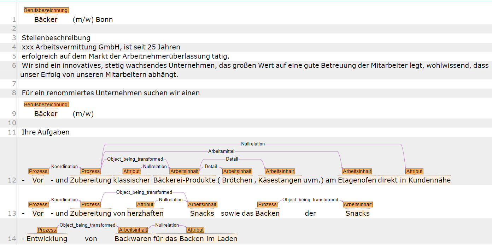
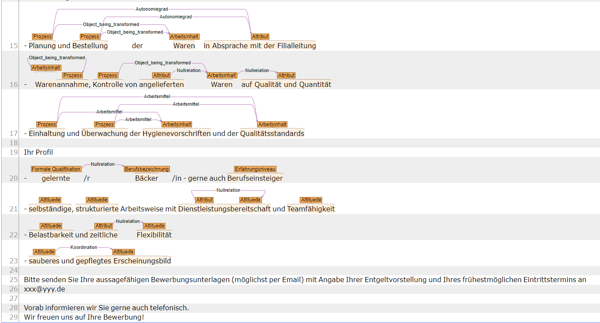

# Public_Stea_Annotationsguide
Guideline für die Annotation von Stellenanzeigen im Berufs- und Kompetenz-Radar.

Dieses Repository enthält zum einen den aktuellen Stand der [Annotationsguidelines](Guidelines/guidelines.md) und zum anderen erste [deskriptive Ergebnisse](Deskriptive_Analysen/README.md), die auf Basis von 500 annotierten Stellenanzeigen erstellt wurden. Diese Analysen sollen zeigen, welche Informationen in Stellenanzeigen zu finden sind und zu welchen Forschungsfragen unsere Modellierung von Anforderungen in Stellenanzeigen möglicherweise hilfreich sein kann.

## Ziel der Annotationen

Im Rahmen des Berufs-Kompetenz-Radars sollen verschiedene Informationen aus Stellenanzeigen für die Berufsbildungsforschung extrahiert und aufbereitet werden. Annotationsguidelines verfolgen dabei zwei Zwecke: zum einen sollen sie die einheitliche Annotationen von Trainingsdaten gewährleisten, die für die automatisierte Annotation benötigt werden, zum anderen sollen sie für die wissenschaftliche Weiterverwendung dokumentieren, wie die verschiedenen Konzepte operationalisiert sind.

Insgesamt sollen in den Stellenanzeigen Informationen zu **Arbeitsaufgaben, Anforderungen, Qualifikationen und Branche** annotiert werden. 

## Beispielanzeige
Basierend auf dem Annotationsguide zu Iter5 wurde diese Anzeige als Beispiel annotiert:

  
  

